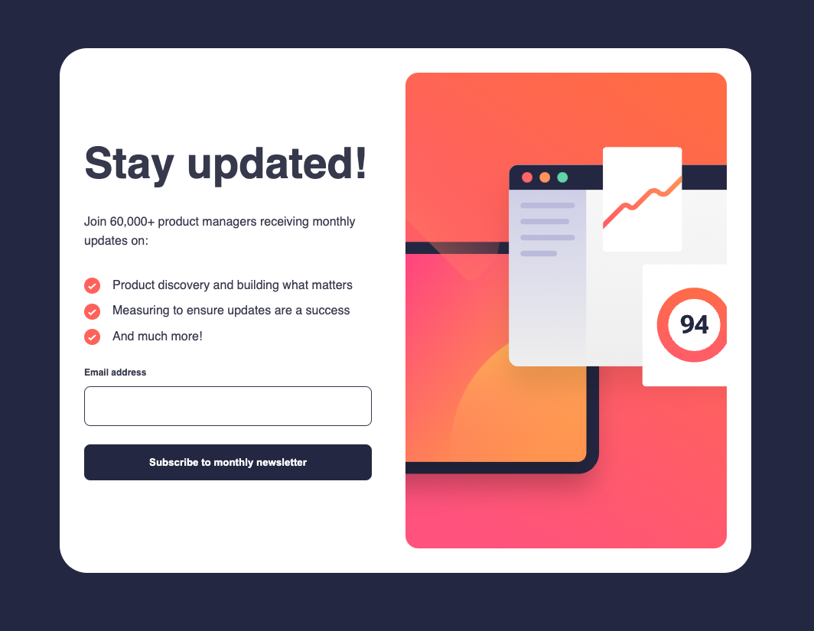

# Frontend Mentor - Article Preview Component

This is a solution to the [Newsletter sign-up form with success message challenge on Frontend Mentor](https://www.frontendmentor.io/challenges/newsletter-signup-form-with-success-message-3FC1AZbNrv). Frontend Mentor challenges help you improve your coding skills by building realistic projects.

## Table of contents

- [Overview](#overview)
  - [Screenshot](#screenshot)
  - [Links](#links)
- [My process](#my-process)
  - [Built with](#built-with)
  - [What I learned](#what-i-learned)
  - [Continued development](#continued-development)
  - [Useful resources](#useful-resources)
- [Author](#author)
- [Acknowledgments](#acknowledgments)

## Overview

### Screenshot



### Links

- Solution Github Repo URL: [Solution repo](https://github.com/cepoumian/newsletter-signup-form)
- Live Site URL: [Solution live](https://cepo-newsletter-signup-form.netlify.app/)

## My process

### Built with

- Web Components
- Semantic HTML5 markup
- Flexbox
- CSS custom properties
- CSS Layers

### What I learned

In this mini project, I wanted to keep working with Web Components. The benefit items in the list seemed like a no-brainer candidate for a reusable component. On the other hand, although the email field is only one, I wanted to create a Field component which could be extended later to make it suittable for other types of fields. Fianlly, the button also seemed like a good opportunity for reusablity since there are two, the "Subscribe" button and the "Dismiss" button in modal that is rendered when the form is submitted.

```js
const template = document.createElement("template");

template.innerHTML = `
  class Field extends HTMLElement {
    static get observedAttributes() {
      return ["type"];
    }

    constructor() {
      super();
      this.root = this.attachShadow({ mode: "open" });
    }

    connectedCallback() {
      this.root.appendChild(fieldTemplate.content.cloneNode(true));
      this.input = this.root.querySelector("input");
      this.field = this.root.querySelector(".field");

      if (this.getAttribute("type") === "email") {
        this.input.addEventListener("input", () => this.validateEmail());
      }
    }

    validateEmail() {
      const email = this.input.value.trim();
      const isValid = /^[^\s@]+@[^\s@]+\.[^\s@]+$/.test(email);
      this.field.classList.toggle("error", !isValid);

      eventBus.emit("validate", { isValid });
    }
  }
`;
```

For such a small project, I didn't see the need to add any abstraction layer for state management. I did, however, create an eventBus singleton to make event dispatching and side effects more convenient.

```js
class EventBus extends EventTarget {
  emit(eventName, detail = {}) {
    this.dispatchEvent(new CustomEvent(eventName, { detail }));
  }

  on(eventName, callback) {
    this.addEventListener(eventName, callback);
  }

  off(eventName, callback) {
    this.removeEventListener(eventName, callback);
  }
}

// Singleton object to manage events
export const eventBus = new EventBus();
```

I also wanted to keep focusing on what I've learned from the [Every Layout](https://every-layout.dev/) CSS methodology.

The Every Layout book proposes an approach to layout based on classes or web components that tackle one specific task at a time. It also makes special emphasis on utilizing css logical properties (inline, block, etc.) instead of properties that would only work in horizontal-tb writing modes (e.g., margin-block-start instead of margin-top).

For example, the Stack has the single task of adding top margin:

```css
.stack {
  display: flex;
  flex-direction: column;
  justify-content: flex-start;
}

.stack > * {
  margin-block: 0;
}

.stack > * + * {
  margin-block-start: var(--spacing-sm);
}
```

The Cover has the task of centering its content vertically and horizontally:

```css
.cover {
  display: flex;
  flex-direction: column;
  min-block-size: 100vh;
  justify-content: center;
  align-items: center;
  padding: 1rem;
}
```

Finally, I also wanted to keep leveraging CSS layers as a way of organizing styles and managing specificity, as suggested by Kevin Powell in his (Frontend Master's course)[https://frontendmasters.com/courses/pro-css/].

```css
@layer utilities {
  .text\:center {
    text-align: center;
  }

  .bg\:light {
    background-color: var(--background-light);
  }
}
```

```css
@layer utilities {
  .text\:center {
    text-align: center;
  }

  .bg\:light {
    background-color: var(--background-light);
  }
}
```

### Useful resources

- [Web Components Book](https://coryrylan.gumroad.com/l/web-component-essentials?layout=profile) - One valuable resource I'm using to learn about web components.

- [Every Layout](https://www.example.com) - This is, by far, one of the most valuable resources on CSS and web layout I've found. Highly recomended.

- [Kevin Powell's Frontend Master's course](https://frontendmasters.com/courses/pro-css/) - One of CSS's greatest educators.

## Author

- Website - [Cesar Poumian](https://github.com/cepoumian)
- Frontend Mentor - [@cepoumian](https://www.frontendmentor.io/profile/cepoumian)
